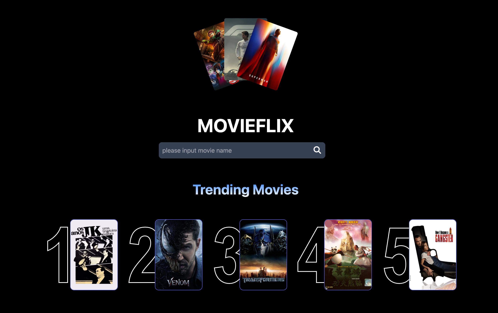

🎬 MovieFlix

MovieFlix is a responsive web application that lets users search for movies, and explore trending titles.
Built with React, Vite, it delivers fast performance and a clean, modern UI.

🔍 Movie Search: Search by title and get instant results powered by a movie API (TMDB).
📄 Movie Details: View poster, release year, rating.
📱 Responsive Design: Works on desktop, tablet, and mobile.
⚡ Fast Build & HMR: Vite provides lightning-fast development and optimized production builds.

Tech: React, Vite, Tailwind CSS, API(TMDB)

